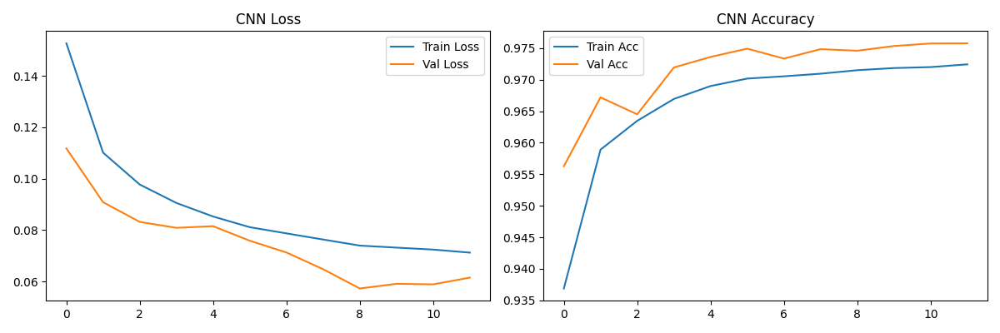

# 🛡️ Zero-Day DDoS Detection System

This project is a high-performance network security solution that detects Distributed Denial of Service (DDoS) attacks using **1D-CNN**, **XGBoost**, and **Random Forest**. It is specifically engineered to handle "Zero-Day" scenarios by training on a hybrid dataset architecture.

---

## 🏆 Global Performance Overview
The following results were obtained on the **completely unseen CICDDoS2019 dataset** (Zero-Day Test) using a standard 0.50 threshold.

| Model | Accuracy | Recall | F1-Score | FPR | Inf. Time |
| :--- | :--- | :--- | :--- | :--- | :--- |
| **XGBoost** | **99.95%** | **99.98%** | **99.96%** | **0.13%** | **~0.4 μs** |
| **Random Forest** | 99.92% | 99.94% | 99.94% | 0.13% | ~3.0 μs |
| **1D-CNN** | 99.49% | 99.33% | 99.63% | 0.13% | ~46.0 μs |

---

## 📖 Methodology: Hybrid Data Engineering
To ensure high generalizability and prevent **Data Leakage**, we implemented a 33/67 split strategy for the modern 2019 dataset:
- **Phase 1 (Mixed Training):** CICIDS2017 (40k) + 33% of CICDDoS2019 subset (5k).
- **Phase 2 (Zero-Day Testing):** 67% of CICDDoS2019 subset (10k) - **Strictly isolated.**
- **Scaling:** `MinMaxScaler` for CNN and `RobustScaler` for ML models to handle network traffic variance.

---

## 🔬 Detailed Model Analysis

### 1. XGBoost (The Top Performer)
Optimized Gradient Boosting for tabular data.
- **Validation (2017 Mix):** Accuracy 99.88% | Recall 99.91%
- **Zero-Day (2019):** Accuracy 99.95% | Recall 99.98%
- **Confusion Matrix:**

### 2. 1D-Convolutional Neural Network (CNN)
Captures complex non-linear patterns in network flow.
- **Validation (2017 Mix):** Accuracy 97.45% | Recall 97.81%
- **Zero-Day (2019):** Accuracy 99.49% | Recall 99.33%
- **Training History:**

- **Confusion Matrix:**

### 3. Random Forest (Ensemble Baseline)
Robust classification using a forest of decision trees.
- **Zero-Day (2019):** Accuracy 99.92% | Recall 99.94%
- **Confusion Matrix:**

---

## 🖥️ Interactive AI Dashboard
We developed a professional **Cyber Security Dashboard** using Streamlit.
- **Live Analysis:** Upload network CSVs for instant threat assessment.
- **XAI Section:** Visualizes top features (like *Init_Win_bytes*) driving the AI's decision.
- **Performance Archive:** Browse through confusion matrices and historical metrics within the app.

---

## 🛠️ Installation & Usage
1. Install dependencies: `pip install -r requirements.txt`
2. Run GUI: `streamlit run src/app_streamlit.py`
3. See [HOW_TO_RUN.md](HOW_TO_RUN.md) for full details.
