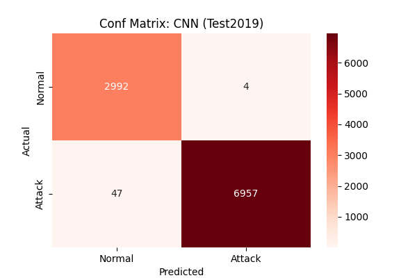
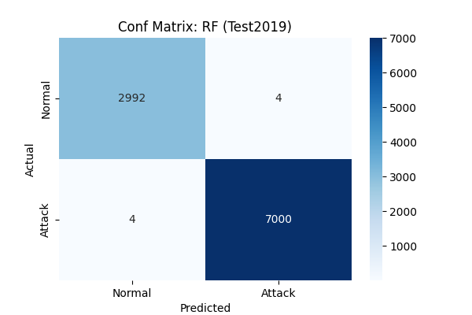

# 🛡️ Zero-Day DDoS Detection System

This project is a high-performance network security solution that detects Distributed Denial of Service (DDoS) attacks using **1D-CNN**, **XGBoost**, and **Random Forest**. It is designed to bridge the gap between older attack patterns (2017) and modern threats (2019).

## 🚀 Key Results (At a Glance)
| Model | Accuracy | Recall | F1-Score | FPR |
| :--- | :--- | :--- | :--- | :--- |
| **XGBoost** | **99.95%** | **99.98%** | **99.96%** | **0.13%** |
| **Random Forest** | 99.92% | 99.94% | 99.94% | 0.13% |
| **1D-CNN** | 99.49% | 99.33% | 99.63% | 0.13% |

---

## 📖 Methodology & Strategy

### Hybrid Dataset Engineering
To achieve these results without data leakage, we implemented a strict split strategy:
- **Training Set:** 40,000 samples (CICIDS2017) + 5,000 samples (33% of CICDDoS2019 subset).
- **Zero-Day Test Set:** 10,000 samples (67% of CICDDoS2019 subset) - **Completely unseen during training.**

### Preprocessing
- **1D-CNN:** Optimized with `MinMaxScaler` for neural stability.
- **ML Models:** Optimized with `RobustScaler` to handle network traffic outliers.

---

## 🏆 Model Performance Analysis

### 1. XGBoost (The Champion)
The best performing model with nearly zero false negatives.
- **Why?** Excellent handling of tabular features and fast inference.
- **Confusion Matrix:** 

### 2. 1D-Convolutional Neural Network
Deep learning approach to capture sequential flow patterns.
- **Architecture:** 2x Conv1D layers + MaxPooling + Dropout.
- **Confusion Matrix:**

### 3. Random Forest
Strong ensemble baseline with identical precision/recall balance.
- **Confusion Matrix:**

---

## 🖥️ Interactive Dashboard
The project includes a **Streamlit** GUI for real-time analysis and explainability.

- **XAI (Explainable AI):** Understand which features (e.g., Init_Win_bytes, Packet Length) are driving the detection.
- **Live Hunter:** Upload any PCAP-derived CSV for instant threat assessment.

### How to Run
Please refer to [HOW_TO_RUN.md](HOW_TO_RUN.md) for detailed installation and execution steps.

---

## 🛠️ Tech Stack
- **AI/ML:** TensorFlow, Scikit-Learn, XGBoost
- **Dashboard:** Streamlit, Plotly
- **Data:** Pandas, NumPy
